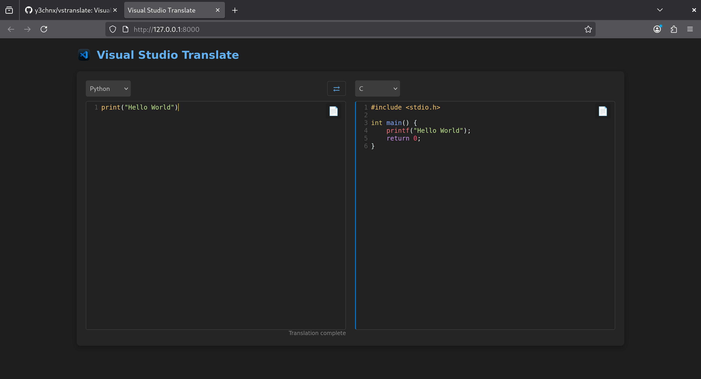

> Visual Studio Translate: A Translator of Programming Languages

    

<iframe width="560" height="315" src="https://www.youtube.com/embed/pkbcvEi3Dl4?si=PnwkiArlPaiv-_B1" title="YouTube video player" frameborder="0" allow="accelerometer; autoplay; clipboard-write; encrypted-media; gyroscope; picture-in-picture; web-share" referrerpolicy="strict-origin-when-cross-origin" allowfullscreen></iframe>


## 📋 Table of Contents

- [Features](#features)
- [Installation](#installation)
- [Usage](#usage)

## ℹ️ Project Information

- **👤 Author:** y3chnx
- **📄 License:** MIT
- **📂 Repository:** [https://github.com/y3chnx/vstranslate](https://github.com/y3chnx/vstranslate)

## Features

- Translate Every High-Level Language
- VS Code Themed Clean Design
- No Heavy VRAMs needed

## Installation

***In order to run this project, you must have Docker installed.***

Download Repository:
```
git clone https://github.com/y3chnx/vstranslate.git
```

Go inside the folder:
```
cd vstranslate
```

Build Docker image: 
```
docker build -t vstranslate .
```

Run Docker Container:
```
docker run -p 8000:8000 vstranslate
```
Open localhost:8000 in your browser:
```
http://localhost:8000
```

## Usage

Type your code and translate!
<br>


